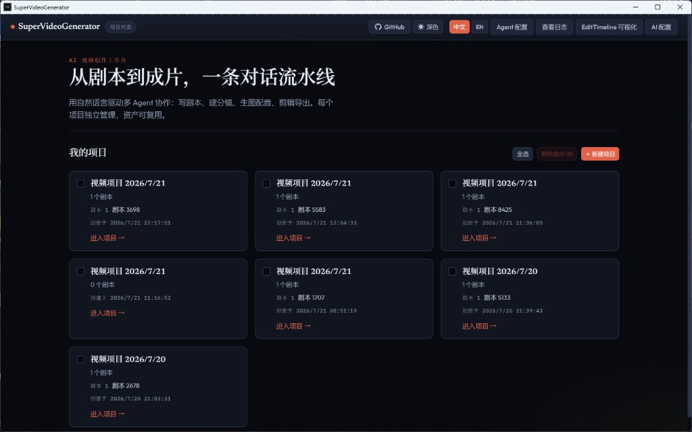
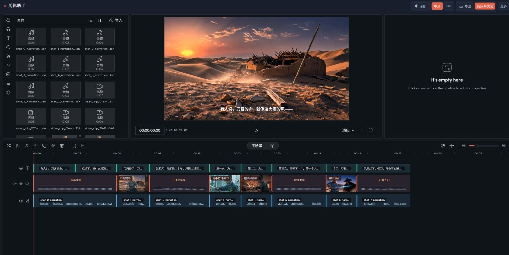

# SuperVideoGenerator

[](LICENSE)
[](https://www.python.org/downloads/)
[](https://github.com/GodyuFF/SuperVideoGenerator/releases)

Language: **中文** | [English](README.en.md)

**从剧本到成片，一条对话流水线。**

不用先学复杂工具：说清楚你想拍什么，多 Agent 帮你走完剧本、分镜、生图、配音与剪辑。自备 API Key，数据默认留在本机。

**开始使用：** [下载安装包](https://github.com/GodyuFF/SuperVideoGenerator/releases) · [快速开始](docs/getting-started.md)（[EN](docs/getting-started.en.md)） · [用户手册](docs/user-guide/README.md) · [产品概览](docs/product-overview.md)（[EN](docs/product-overview.en.md)）

## 产品长什么样

按真实界面走一遍主流程（截图来自 [用户手册](docs/user-guide/README.md)）。

### 1. 项目列表

管理「我的项目」，从这里新建并进入剧本。



### 2. 对话与执行计划

左侧用自然语言推进；右侧计划可见可审，确认卡片避免黑盒一键出片。详见 [对话与执行计划](docs/user-guide/03-chat-and-plan.md)。


### 3. 生成队列

生图、配音等媒体任务排队执行，可随时查看进度。


### 4. 剪辑助手

多轨精修字幕、画面与旁白，顶栏导出成片。详见 [剪辑与导出](docs/user-guide/05-edit-and-export.md)。



## Demo

示例题材：女娲补天（故事书成片）。

| 步骤 | 说明 |
|------|------|
| 对话 | 自然语言描述创意，主 Agent 编排计划 |
| 分镜与资产 | 看板可见可改，人物 / 场景可复用 |
| 剪辑 | 剪辑助手多轨精修字幕、画面与旁白 |
| 成片 | 导出故事书视频 |

**成片演示：**

<a href="site/assets/demo-final.mp4">
  
</a>

> GitHub README 无法内嵌播放本地视频；点击封面即可打开 [`demo-final.mp4`](site/assets/demo-final.mp4)。

**对应剪辑时间轴：**


## 怎么用（从零到成片）

推荐首次用 **故事书模式**（只需 LLM + 生图 + TTS，不必开通视频 API）。完整步骤见 [从零到成片](docs/user-guide/01-first-video.md)。

| 步骤 | 做什么 |
|------|--------|
| 1. 配置 AI | 顶栏 **「AI 配置」**：填 LLM / 图片 Key；TTS 默认 edge 即可；故事书可先关掉视频 Tab |
| 2. 建项目与剧本 | **「我的项目」** → 新建项目 → 新建剧本 → **「进入剧本」** |
| 3. 对话推进 | 选故事书模式，关闭目标模式；描述创意并发送；按确认卡片继续，盯住右侧执行计划 |
| 4. 看板微调 | 在剧本详情 / 角色 / 分镜等 Tab 检查与修改旁白、字幕 |
| 5. 剪辑导出 | **「剪辑」** Tab 预览 → **「剪辑修改」** 进入剪辑助手 → 顶栏 **「导出」** 得到 MP4 |

## 三种视频风格

风格在剧本**首次发送后锁定**；要换风格请新建剧本。对照见 [视频风格与模式](docs/user-guide/06-modes.md)。

| 风格 | 适合 | AI 配置 |
|------|------|---------|
| **故事书模式** | 首次上手；静图 + 旁白合成 | LLM + 图片 + TTS |
| **AI 视频模式** | 需要模型生成动态片段 | 另须启用 **「视频」** Tab 并填视频 API Key |
| **画面图生视频** | 以已有画面做图生视频 | 同上，需可用的视频能力与画面资产 |

## 能力亮点

| 能力 | 说明 |
|------|------|
| **对话编排** | 主 Agent（ReAct）编排剧本 → 分镜 → 生图 → 配音 → 剪辑；计划可见，确认可审 |
| **看板与资产** | 剧本、角色、空镜、分镜可检查可改；人物 / 场景可跨剧本复用 |
| **剪辑助手** | 素材库 + 预览监视器 + 多轨时间轴；导出 MP4，改动写回剧本 |
| **本机优先** | Key 与项目数据默认留在本机；桌面安装包开箱即用，也可从源码跑开发壳 |
| **多家模型** | 对话与生成可对接多套 LLM / 生图 / TTS，按场景选型，不锁死单一平台 |

## 快速开始

**日常使用：** 从 [Releases](https://github.com/GodyuFF/SuperVideoGenerator/releases) 下载桌面安装包，在应用内配置 API Key 即可（未签名提示属预期）。

**从源码开发（桌面壳）：** 需 Python 3.11+、Node.js 18+。安装依赖后在仓库根目录运行：

```bat
launch-desktop.vbs
```

完整步骤：[docs/getting-started.md](docs/getting-started.md) · [docs/getting-started.en.md](docs/getting-started.en.md)。打包与开发壳细节见 [apps/desktop/README.md](apps/desktop/README.md)。

装好后请按 [用户手册](docs/user-guide/README.md) 阅读；常见问题见 [FAQ](docs/user-guide/07-faq.md)。

## 一起交流

对产品用法、编排思路或二次开发感兴趣？欢迎加群探讨——问题反馈、案例分享、一起打磨工作流。

| 方式 | 内容 |
|------|------|
| QQ 群 | `829936747` |
| 微信群 | 扫下方二维码（会过期；失效请用 QQ 或邮件） |
| 邮箱 | [312188032@qq.com](mailto:312188032@qq.com) |


## Architecture

```
apps/web (Vite + React)  ──HTTP/WS──►  apps/api (FastAPI)
                                            │
                                       core/ (llm · edit · tts · store · …)
```

## Documentation

| 文档 | 说明 |
|------|------|
| [文档目录](docs/README.md) | 入门与手册导航 |
| [产品概览](docs/product-overview.md) / [EN](docs/product-overview.en.md) | 定位与原则摘要 |
| [快速开始](docs/getting-started.md) / [EN](docs/getting-started.en.md) | 安装与启动 |
| [用户手册](docs/user-guide/README.md) | 从零到成片、配置、对话、看板、剪辑、模式与 FAQ |
| └ [从零到成片](docs/user-guide/01-first-video.md) | 跑通第一条故事书视频 |
| └ [AI 配置](docs/user-guide/02-ai-config.md) | LLM / 图片 / TTS / 视频 |
| └ [对话与执行计划](docs/user-guide/03-chat-and-plan.md) | 确认卡片与计划面板 |
| └ [看板与资产](docs/user-guide/04-board-and-assets.md) | 剧本、角色、分镜 |
| └ [剪辑与导出](docs/user-guide/05-edit-and-export.md) | 剪辑助手与成片导出 |
| [贡献指南](CONTRIBUTING.md) | Issue / PR |
| [安全政策](SECURITY.md) | 漏洞私下报告 |
| [行为准则](CODE_OF_CONDUCT.md) | 社区规范 |

## License

本项目采用 [MIT License](LICENSE)。

剪辑助手相关代码基于 **OpenCut**，其版权与许可声明见 [THIRD_PARTY_NOTICES.md](THIRD_PARTY_NOTICES.md) 与 [`apps/web/src/editor/opencut/LICENSE`](apps/web/src/editor/opencut/LICENSE)。

使用各 LLM、生图、TTS 等云服务时，请另行遵守对应服务商条款。
