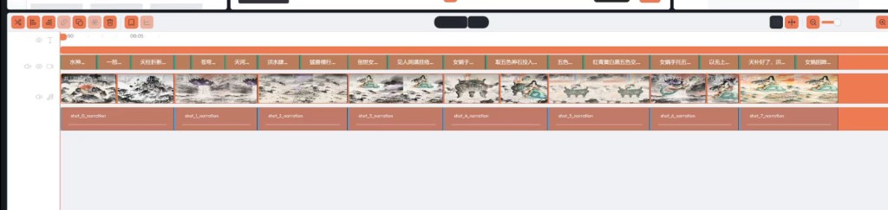

# SuperVideoGenerator

基于多 Agent 协作的 AI 视频生成系统。用自然语言描述创意，**超级视频大师** 以 ReAct 编排剧本、分镜、生图、配音、剪辑等子 Agent，完成从创意到成片；支持看板精修与 Edit Studio 多轨时间轴。

**一句话：** 从剧本到成片，一条对话流水线。

多 Agent 协作的**本地优先** AI 视频工具：对话驱动剧本与分镜，看板精修，Edit Studio 多轨成片；自备 API Key，数据默认留在本机。

**Topics（GitHub About 可填）：** `ai` · `video-generation` · `electron` · `fastapi` · `react` · `opencut` · `mit` · `multi-agent`

## Demo

示例题材：女娲补天（故事书成片）。

| 步骤 | 说明 |
|------|------|
| 对话 | 自然语言描述创意，主 Agent 编排计划 |
| 分镜与资产 | 看板可见可改，人物 / 场景可复用 |
| 剪辑 | Edit Studio 多轨精修字幕、画面与旁白 |
| 成片 | 导出故事书视频 |

**成片演示（女娲补天）：**

<a href="site/assets/demo-final.mp4">
  
</a>

> GitHub README 无法内嵌播放本地视频；点击上方封面图即可打开 [`demo-final.mp4`](site/assets/demo-final.mp4) 在线观看。

**对应剪辑时间轴：**



本地还可打开完整静态介绍页（中/EN）：[`site/index.html`](site/index.html)（说明见 [`site/README.md`](site/README.md)）。

## Features

- **对话 + 看板**：Plan 可见可审，A2UI 确认；可选 Goal 自主模式
- **子 Agent 流水线**：剧本 / 分镜 / 生图 / TTS / 剪辑 / AI 视频
- **资产与 RAG**：人物·道具·场景跨剧本复用；详情页二次生成与生成队列
- **Edit Studio**：镜内多轨、OpenCut 剪辑助手、可写回 Shot
- **本地优先**：项目与 API Key 落在本机 `data/`，默认不入 Git
- **桌面分发**：Electron 开发壳 + 完整离线安装包（GitHub Releases）

## Architecture

```
apps/web (Vite + React)  ──HTTP/WS──►  apps/api (FastAPI)
                                            │
                                       core/ (llm · edit · tts · store · …)
```

## Requirements

- Python 3.11+
- Node.js 18+
- FFmpeg（可选，遗留导出路径）

## Quick Start

```bash
python -m venv .venv
.venv\Scripts\activate          # Windows；macOS/Linux: source .venv/bin/activate
pip install -r requirements.txt
cd apps/web && npm install && cd ../..
cp .env.example .env            # 至少配置 LLM API Key
```

**启动（Windows 推荐）：**

```bat
launch-desktop.vbs
```

或浏览器模式：`uvicorn apps.api.main:app --port 8000` + `cd apps/web && npm run dev` → [http://localhost:5173](http://localhost:5173)

更完整的步骤见 [docs/getting-started.md](docs/getting-started.md)。

## Desktop

- 开发壳：`launch-desktop.vbs` / `launch-desktop.bat`，或 `cd apps/desktop && npm start`
- 安装包：[GitHub Releases](https://github.com/GodyuFF/SuperVideoGenerator/releases)
- 本地打 Windows 包：`.\apps\desktop\packaging\build-desktop.ps1`（说明见 [apps/desktop/README.md](apps/desktop/README.md)）

## Documentation

| 文档 | 说明 |
|------|------|
| [文档索引](docs/README.md) | 入门与手册导航 |
| [产品概览](docs/product-overview.md) | 定位与原则摘要 |
| [快速开始](docs/getting-started.md) | 安装与启动 |
| [贡献指南](CONTRIBUTING.md) | Issue / PR |
| [安全政策](SECURITY.md) | 漏洞私下报告 |
| [行为准则](CODE_OF_CONDUCT.md) | 社区规范 |

## Contact

| 方式 | 内容 |
|------|------|
| QQ 群 | `829936747` |
| 邮箱 | [312188032@qq.com](mailto:312188032@qq.com) |
| 微信群 | 扫码加入（二维码会过期，失效请用 QQ / 邮箱） |


## License

本项目采用 [MIT License](LICENSE)。

剪辑助手（Edit Studio）相关代码基于 **OpenCut**，其版权与许可声明见 [THIRD_PARTY_NOTICES.md](THIRD_PARTY_NOTICES.md) 与 [`apps/web/src/editor/opencut/LICENSE`](apps/web/src/editor/opencut/LICENSE)。

使用各 LLM、生图、TTS 等云服务时，请另行遵守对应服务商条款。
