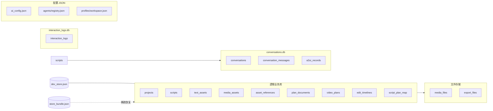
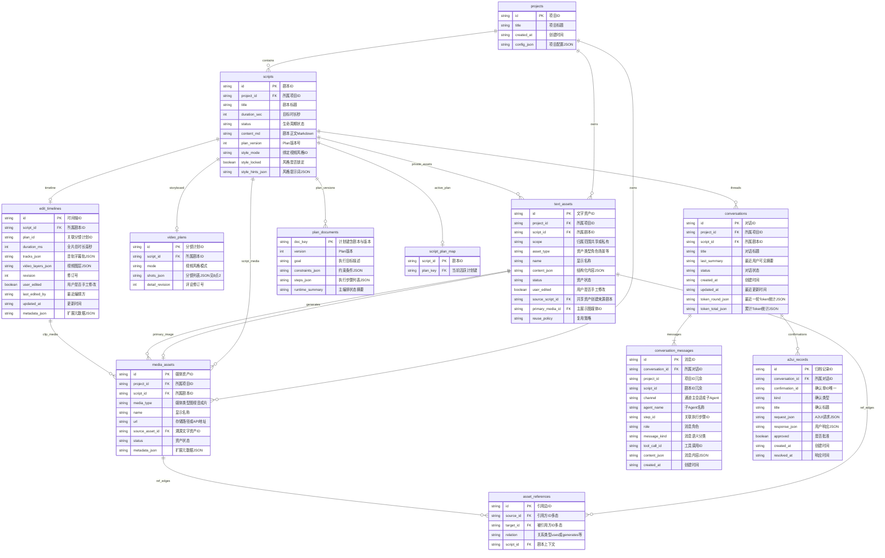
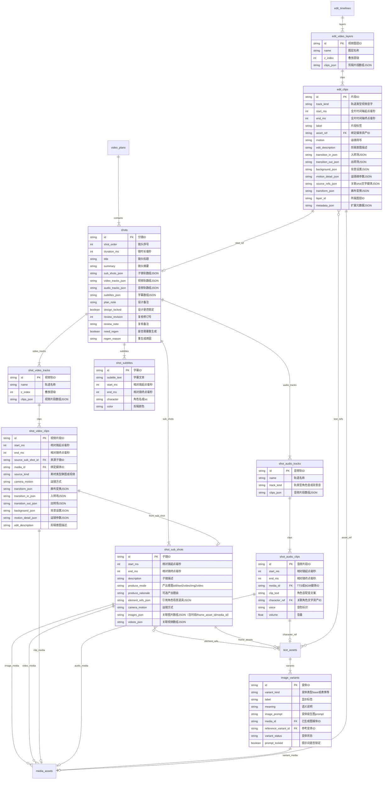
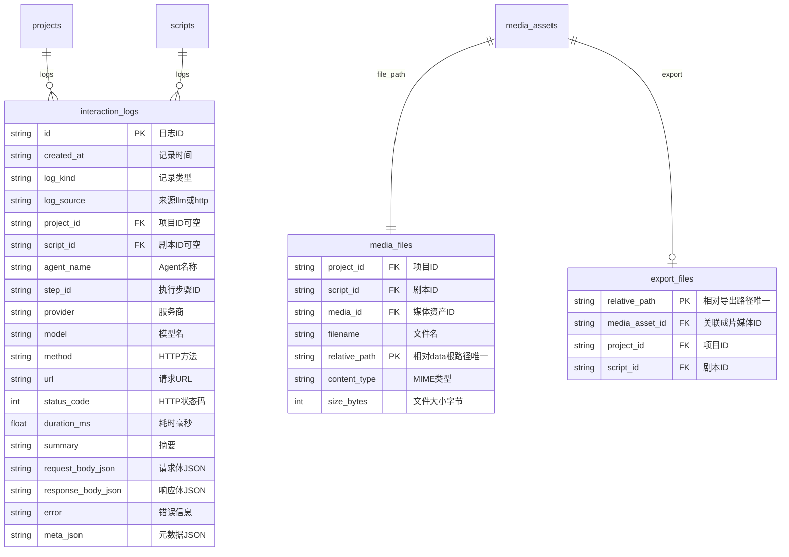
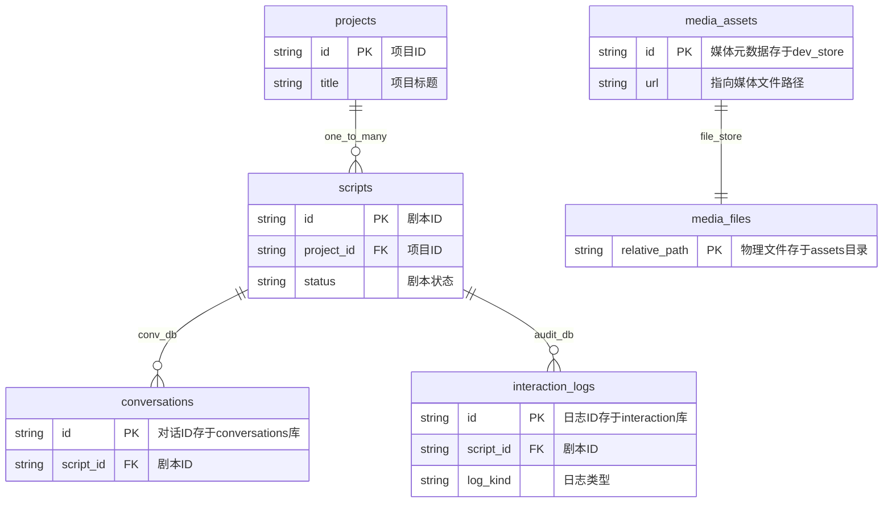

# 数据存储表结构设计与关联关系图

> 版本：v1.1 | 更新：2026-07-14（ShotSubShot produce_mode / 画面时段字段）
> 姊妹文档：[`data-storage.md`](data-storage.md)（持久化流程、目录、恢复策略）

本文以 **数据库设计视角** 描述 SuperVideoGenerator 的存储结构：逻辑表字段、主外键、基数关系与 ER 图。  
实现上并非单一 RDBMS，而是 **MemoryStore 逻辑表 + SQLite 真表 + JSON 文档 + 文件 BLOB** 混合存储。

---

## 目录

1. [存储拓扑（多库视图）](#1-存储拓扑多库视图)
2. [逻辑库 A：业务主库（MemoryStore / dev_store.json）](#2-逻辑库-a业务主库memorystore--dev_storejson)
3. [嵌套文档表（JSON 内嵌子表）](#3-嵌套文档表json-内嵌子表)
4. [逻辑库 B：对话库（conversations.db）](#4-逻辑库-b对话库conversationsdb)
5. [逻辑库 C：审计库（interaction_logs.db）](#5-逻辑库-c审计库interaction_logsdb)
6. [逻辑库 D：配置库（JSON 文件）](#6-逻辑库-d配置库json-文件)
7. [逻辑库 E：媒体文件库（assets/media）](#7-逻辑库-e媒体文件库assetsmedia)
8. [全局 ER 关系图](#8-全局-er-关系图)
9. [关联关系明细表](#9-关联关系明细表)
10. [索引与约束（逻辑）](#10-索引与约束逻辑)

---

## 1. 存储拓扑（多库视图）



| 逻辑库 | 物理载体 | 表数量 | 备注 |
|--------|----------|--------|------|
| **业务主库** | `MemoryStore` ↔ `dev_store.json` | 9 张逻辑表 + 嵌套子表 | 项目/资产/分镜/剪辑核心数据 |
| **对话库** | `conversations.db` | 3 张 SQLite 表 | 消息与 A2UI 归档 |
| **审计库** | `interaction_logs.db` + JSONL | 1 张 SQLite 表 | LLM/API 调用日志 |
| **配置库** | `ai_config.json`、`agents/` | 2+ 文档 | 全局 AI 与 Agent 配置 |
| **媒体库** | `data/projects/.../assets/` | 文件行 | 二进制媒体，元数据在 `media_assets` |

---

## 2. 逻辑库 A：业务主库（MemoryStore / dev_store.json）

持久化键名见 `dev_store.json` 顶层字段（`core/store/persist.py`）。

### 2.1 `projects` — 项目

| 列名 | 类型 | 约束 | 说明 |
|------|------|------|------|
| `id` | VARCHAR | **PK** | `proj_{uuid12}` |
| `title` | VARCHAR | NOT NULL | 项目标题 |
| `created_at` | VARCHAR(ISO8601) | | 创建时间 |
| `config` | JSON | | 嵌入 `ProjectConfig`（见下） |

**`config` 嵌入结构（非独立表）**：

| 路径 | 类型 | 说明 |
|------|------|------|
| `config.generation.mode` | ENUM | `auto` |
| `config.generation.execution_mode` | ENUM | `interactive` \| `goal` |
| `config.generation.require_plan_approval` | BOOL | Plan 人工确认 |
| `config.generation.require_script_structure_approval` | BOOL | 剧本结构 A2UI |
| `config.style.mode` | VARCHAR | `storybook` \| `ai_video` |
| `config.style.aspect_ratio` | ENUM | `16:9` \| `9:16` \| `1:1` |
| `config.image_text.source_mode` | ENUM | `generate` \| `search` \| `user_choice` |
| `config.agents.overrides` | JSON | 项目级 Agent 提示词覆盖 |

磁盘镜像：`data/projects/{project_id}/project.json`

---

### 2.2 `scripts` — 剧本

| 列名 | 类型 | 约束 | 说明 |
|------|------|------|------|
| `id` | VARCHAR | **PK** | `script_{uuid12}` |
| `project_id` | VARCHAR | **FK → projects.id** | 所属项目 |
| `title` | VARCHAR | NOT NULL | 剧本标题 |
| `duration_sec` | INT | DEFAULT 60 | 目标时长 |
| `status` | ENUM | | `draft` \| `planned` \| `executing` \| `completed` \| `failed` |
| `content_md` | TEXT | | 剧本正文 Markdown |
| `plan_version` | INT | DEFAULT 0 | Plan 版本号 |
| `created_at` | VARCHAR | | ISO UTC 创建时间；整体看板按此升序编号 |
| `style_mode` | VARCHAR | NULL | 绑定视频风格 id |
| `style_locked` | BOOL | DEFAULT false | 风格锁定 |
| `style_hints` | JSON | | 通用提示词键值 |

磁盘镜像：`data/projects/{project_id}/scripts/{script_id}/script.json`

---

### 2.3 `text_assets` — 文字资产

| 列名 | 类型 | 约束 | 说明 |
|------|------|------|------|
| `id` | VARCHAR | **PK** | `txt_{uuid12}` |
| `project_id` | VARCHAR | **FK → projects.id** | 所属项目 |
| `script_id` | VARCHAR | **FK → scripts.id**, NULL | 私有资产必填；共享池为 NULL |
| `scope` | ENUM | NOT NULL | `project_shared` \| `script_private` |
| `type` | ENUM | NOT NULL | `character` \| `prop` \| `scene` \| `frame` \| `plot` \| `narration` |
| `name` | VARCHAR | NOT NULL | 显示名 |
| `content` | JSON | NOT NULL | 结构化内容（图文见 §3.1） |
| `status` | ENUM | | `draft` \| `ready` \| `locked` \| `generated` \| `archived` |
| `user_edited` | BOOL | DEFAULT false | UI 手工修改 |
| `source_script_id` | VARCHAR | **FK → scripts.id**, NULL | 共享资产首次创建来源 |
| `primary_media_id` | VARCHAR | **FK → media_assets.id**, NULL | 主展示图（base 变体） |
| `reuse_policy` | ENUM | | `shared` \| `private` |

**scope × type 业务规则**：

| type | 默认 scope | 跨剧本共享 |
|------|------------|------------|
| character, prop, scene | project_shared | ✅ |
| plot, narration, frame | script_private | ❌ |

---

### 2.4 `media_assets` — 数字媒体资产

| 列名 | 类型 | 约束 | 说明 |
|------|------|------|------|
| `id` | VARCHAR | **PK** | `media_{uuid12}` |
| `project_id` | VARCHAR | **FK → projects.id** | 所属项目 |
| `script_id` | VARCHAR | **FK → scripts.id**, NULL | 默认剧本私有 |
| `type` | ENUM | NOT NULL | `image` \| `video` \| `audio` \| `final` |
| `name` | VARCHAR | NOT NULL | 显示名 |
| `url` | VARCHAR | | 相对路径或 API URL |
| `source_asset_id` | VARCHAR | **FK → text_assets.id**, NULL | 溯源文字资产 |
| `status` | ENUM | | 同 text_assets |
| `metadata` | JSON | | `duration_ms`, `shot_id`, `superseded` 等 |

**`url` 与文件库关联**：`url` → `media_files.relative_path`（§7）

---

### 2.5 `asset_references` — 显式引用边

持久化键：`dev_store.references`

| 列名 | 类型 | 约束 | 说明 |
|------|------|------|------|
| `id` | VARCHAR | **PK** | `ref_{uuid12}` |
| `source_id` | VARCHAR | **FK → 多态** | 引用方（script/txt/media/shot 等 id） |
| `target_id` | VARCHAR | **FK → 多态** | 被引用方 |
| `relation` | ENUM | NOT NULL | 见 §9 |
| `script_id` | VARCHAR | **FK → scripts.id**, NULL | 剧本上下文 |

> 多态 FK：运行时通过 id 前缀或谱系解析器定位目标表，无数据库级外键约束。

---

### 2.6 `plan_documents` — ReAct 执行计划

持久化键：`dev_store.plans`  
键格式：`{script_id}_v{version}`

| 列名 | 类型 | 约束 | 说明 |
|------|------|------|------|
| `key` | VARCHAR | **PK** | `{script_id}_v{version}` |
| `version` | INT | NOT NULL | Plan 版本 |
| `goal` | TEXT | | 目标描述 |
| `constraints` | JSON | | 约束条件 |
| `steps` | JSON[] | | `PlanStep[]` 嵌套（§3.4） |
| `runtime_summary` | TEXT | | 主编排最新 plan_status |

---

### 2.7 `script_plan_map` — 剧本当前 Plan 指针

持久化键：`dev_store.script_plans`（内存 `_script_plans`）

| 列名 | 类型 | 约束 | 说明 |
|------|------|------|------|
| `script_id` | VARCHAR | **PK**, FK → scripts.id | 剧本 |
| `plan_key` | VARCHAR | **FK → plan_documents.key** | 当前活跃 plan |

---

### 2.8 `video_plans` — 分镜计划稿

| 列名 | 类型 | 约束 | 说明 |
|------|------|------|------|
| `id` | VARCHAR | **PK** | `plan_{uuid12}` |
| `script_id` | VARCHAR | **FK → scripts.id**, UNIQUE* | 每剧本至多一个活跃计划 |
| `mode` | ENUM | | `storybook` \| `ai_video` |
| `shots` | JSON[] | NOT NULL | `Shot[]` 嵌套（§3.2） |
| `detail_revision` | INT | DEFAULT 0 | 详设修订号 |

\* 逻辑唯一：查询 `get_video_plan_for_script` 取第一个匹配项。

---

### 2.9 `edit_timelines` — 全片剪辑时间轴

| 列名 | 类型 | 约束 | 说明 |
|------|------|------|------|
| `id` | VARCHAR | **PK** | `etl_{uuid12}` |
| `script_id` | VARCHAR | **FK → scripts.id**, UNIQUE* | 每剧本至多一个 |
| `plan_id` | VARCHAR | | 关联 video_plans.id |
| `duration_ms` | INT | DEFAULT 0 | 总时长 |
| `tracks` | JSON | | `{ audio: EditClip[], subtitle: EditClip[] }` |
| `video_layers` | JSON[] | | `EditVideoLayer[]`（§3.3） |
| `revision` | INT | DEFAULT 0 | 修订号 |
| `user_edited` | BOOL | DEFAULT false | 用户手改 |
| `last_edited_by` | VARCHAR | | `user` \| `agent` \| `system_tts_sync` |
| `updated_at` | VARCHAR(ISO8601) | | |
| `metadata` | JSON | | 扩展 |

---

## 3. 嵌套文档表（JSON 内嵌子表）

以下结构**不独立落盘为表**，嵌套在父文档 JSON 中；谱系查询时展开为逻辑边。

### 3.1 `text_assets.content` — 图文资产内容

**共用列**（character / prop / scene；frame 见下节精简字段）：

| 列名 | 类型 | 说明 |
|------|------|------|
| `summary` | VARCHAR | 卡片摘要 |
| `description` | TEXT | 主视觉描述（角色/空镜/物品） |
| `image_prompt` | TEXT | 组装后的生图 prompt |
| `negative_prompt` | TEXT | 负向 prompt |
| `prompt_locked` | BOOL | 用户锁定 |
| `prompt_version` | INT | 组装器版本 |
| `display_mode` | ENUM | `static_image` \| `dynamic_image` |
| `image_variants` | JSON[] | → §3.1.1 |

**frame 精简字段**（前端/工具五块；旧 `description`/`composition_prompt` 仅兼容读取）：

| 列名 | 类型 | 说明 |
|------|------|------|
| `summary` | VARCHAR | 摘要 |
| `image_prompt` | TEXT | **生图提示词**（用户/Agent 直接填写，锁定后不重算） |
| `notes` | TEXT | AI 编排自用备注（不进入 `image_prompt`） |
| `element_refs` | JSON | `{ scene: [txt_id], character: [...], prop: [...], frame: [...] }` |
| `variant_refs` | JSON | 变体引用映射（系统） |
| `shot_id` | VARCHAR | FK → Shot.id（逻辑） |
| `prompt_locked` / `prompt_version` / `negative_prompt` | | 组装元数据 |

**video_clip 精简字段**（前端/工具五块；`video_mode`/`camera_motion`/`duration_sec` 由系统/子镜派生）：

| 列名 | 类型 | 说明 |
|------|------|------|
| `summary` | VARCHAR | 视频简述 |
| `video_prompt` | TEXT | **生视频提示词** |
| `notes` | TEXT | AI 编排自用备注（不进入 `video_prompt`） |
| `element_refs` | JSON | 参考图文资产（scene/character/prop/frame） |
| `media_refs` | JSON[] | 落盘图片 media_id 列表 |
| `reference_order` | JSON[] | 参考图收集顺序（系统） |
| `video_mode` | ENUM | 系统派生：`auto` \| `text2video` \| `img2video` \| `keyframes` |
| `duration_sec` | FLOAT | 系统/子镜派生目标时长（秒） |
| `camera_motion` | VARCHAR | 自子镜派生的运镜提示 |
| `shot_id` / `sub_shot_id` | VARCHAR | 溯源镜/子镜（可选） |
| `prompt_locked` / `prompt_version` | | 组装元数据 |

生成后 `text_assets.primary_media_id` → `media_assets.type=video`；子镜 `videos[].video_clip_asset_id` 指向该文字资产。

#### 3.1.1 `image_variants[]` — 图片变体（嵌套）

| 列名 | 类型 | 约束 | 说明 |
|------|------|------|------|
| `id` | VARCHAR | PK | `var_{uuid12}` |
| `kind` | ENUM | | `base` \| `expression` \| `pose` \| `action` \| `costume` \| `other` |
| `label` | VARCHAR | | 显示标签 |
| `meaning` | VARCHAR | | 语义说明 |
| `image_prompt` | TEXT | | 变体级 prompt |
| `media_id` | VARCHAR | FK → media_assets.id | 已生成图 |
| `reference_variant_id` | VARCHAR | FK → image_variants.id | 参考变体（通常 base） |
| `status` | ENUM | | `pending` \| `ready` \| `failed` |

---

### 3.2 `video_plans.shots[]` — 分镜（嵌套主表）

| 列名 | 类型 | 约束 | 说明 |
|------|------|------|------|
| `id` | VARCHAR | PK | `shot_{uuid12}` |
| `order` | INT | NOT NULL | 镜头序号 |
| `duration_ms` | INT | > 0 | 镜时长（由配音/素材实测驱动，无硬上限） |
| `title` | VARCHAR | | |
| `summary` | TEXT | | |
| `sub_shots` | JSON[] | | → §3.2.1 |
| `video_tracks` | JSON[] | | → §3.2.2 |
| `audio_tracks` | JSON[] | | → §3.2.3 |
| `subtitles` | JSON[] | | → §3.2.4 |
| `design_locked` | BOOL | | 设计锁定 |
| `need_regen` | BOOL | | 需重生成 |

#### 3.2.1 `ShotSubShot`（子镜 · 镜内剧本时间轴时段）

镜内 `ShotSubShot` 与剧本 Tab「画面」(frame) **解耦**；可零或多张图片、多段视频。`start_ms`/`end_ms` 定义镜内剧本时间轴时段（相对镜起点）。`produce_mode` 声明产出意图；`produce_rationale` 可选。`images[].frame_asset_id` 可选关联剧本画面文字资产；`images[].start_ms/end_ms` 为画面占用时段（相对镜起点，`0+0` 解析时回填子镜区间）。

| 列名 | 类型 | FK | 说明 |
|------|------|-----|------|
| `id` | VARCHAR | PK `ssb_*` | |
| `start_ms` / `end_ms` | INT | | 相对镜起点 |
| `description` | TEXT | | 子镜描述 |
| `produce_mode` | ENUM | | `still` \| `text2video` \| `img2video`；默认 `still`（历史值自动规范） |
| `produce_rationale` | TEXT | | 可选短理由 |
| `element_refs` | JSON | → text_assets.id | character/scene/prop 列表 |
| `camera_motion` | VARCHAR | | 运镜 |
| `images[].id` | VARCHAR | PK `ssi_*` | 关联图片槽 |
| `images[].kind` | ENUM | | `static` \| `video` |
| `images[].frame_asset_id` | VARCHAR | → text_assets.id (frame) | 可选关联剧本画面 |
| `images[].media_id` | VARCHAR | → media_assets.id | 已生成图 |
| `images[].source_media_ids` | VARCHAR[] | → media_assets.id | 参考图 |
| `images[].start_ms` / `end_ms` | INT | | 画面占用时段，相对镜起点；`0+0` 回填子镜区间 |
| `videos[].id` | VARCHAR | PK `ssv_*` | 关联视频槽 |
| `videos[].media_id` | VARCHAR | → media_assets.id | 已生成视频 |
| `videos[].start_ms` / `end_ms` | INT | | 相对子镜起点 |

#### 3.2.2 `ShotVideoTrack` → `ShotVideoClip`（视频轨）

| 列名 | 类型 | FK | 说明 |
|------|------|-----|------|
| `ShotVideoTrack.id` | VARCHAR | PK `svt_*` | 视频图层 |
| `ShotVideoTrack.z_index` | INT | | 叠放顺序 |
| `ShotVideoClip.id` | VARCHAR | PK `svc_*` | 视频片段 |
| `ShotVideoClip.source_sub_shot_id` | VARCHAR | → ShotSubShot.id | |
| `ShotVideoClip.media_id` | VARCHAR | → media_assets.id | |
| `ShotVideoClip.source_kind` | ENUM | | `still` \| `video` |

#### 3.2.3 `ShotAudioTrack` → `ShotAudioClip`（音频轨）

| 列名 | 类型 | FK | 说明 |
|------|------|-----|------|
| `ShotAudioTrack.id` | VARCHAR | PK `sat_*` | |
| `ShotAudioTrack.kind` | ENUM | | `voice` \| `background` |
| `ShotAudioClip.id` | VARCHAR | PK `sac_*` | |
| `ShotAudioClip.media_id` | VARCHAR | → media_assets.id | TTS/BGM |
| `ShotAudioClip.character_ref` | VARCHAR | → text_assets.id (character) | 角色音 |
| `ShotAudioClip.text` | TEXT | | 配音文案 |

#### 3.2.4 `ShotSubtitle`（镜内字幕）

| 列名 | 类型 | 说明 |
|------|------|------|
| `id` | VARCHAR PK `ssub_*` | |
| `text` | TEXT | |
| `start_ms` / `end_ms` | INT | 相对镜起点 |
| `character` | VARCHAR | 角色名或 `txt_*`；空=旁白/未指定 |
| `color` | VARCHAR | 剪辑用颜色（如 `#RRGGBB`）；空=默认样式 |

---

### 3.3 `edit_timelines.video_layers[]` — 剪辑层（嵌套）

| 列名 | 类型 | FK | 说明 |
|------|------|-----|------|
| `EditVideoLayer.id` | VARCHAR | PK `vly_*` | |
| `EditVideoLayer.z_index` | INT | | |
| `EditClip.id` | VARCHAR | PK `clip_*` | |
| `EditClip.track` | ENUM | | `video` \| `audio` \| `subtitle` |
| `EditClip.start_ms` / `end_ms` | INT | | 全片时间轴 |
| `EditClip.asset_ref` | VARCHAR | → media_assets.id | 素材 |
| `EditClip.source_refs.shot_id` | VARCHAR | → Shot.id | |
| `EditClip.source_refs.text_asset_ids` | VARCHAR[] | → text_assets.id | |
| `EditClip.source_refs.media_ids` | VARCHAR[] | → media_assets.id | |
| `EditClip.transform` | JSON | | 画布变换 + keyframes |

---

### 3.4 `plan_documents.steps[]` — 执行步骤（嵌套）

| 列名 | 类型 | 说明 |
|------|------|------|
| `id` | VARCHAR PK `step_*` | |
| `type` | VARCHAR | 步骤类型 |
| `agent` | VARCHAR | 子 Agent 名 |
| `depends_on` | VARCHAR[] | 依赖 step id |
| `status` | ENUM | `pending` \| `running` \| `completed` \| `failed` \| `awaiting_confirmation` \| `paused` |
| `outputs` | JSON[] | `{ kind, label, asset_id, url }` |

---

## 4. 逻辑库 B：对话库（conversations.db）

真 SQLite 表（`core/conversation/sqlite_store.py`）。

### 4.1 `conversations`

```sql
CREATE TABLE conversations (
    id                      TEXT PRIMARY KEY,          -- conv_{uuid12}
    project_id              TEXT NOT NULL,             -- FK → projects.id
    script_id               TEXT NOT NULL,             -- FK → scripts.id
    title                   TEXT,
    last_summary            TEXT,
    status                  TEXT,                        -- active | archived
    created_at              TEXT,
    updated_at              TEXT,
    last_round_token_usage  TEXT,                        -- JSON
    total_token_usage       TEXT                         -- JSON
);
```

### 4.2 `conversation_messages`

```sql
CREATE TABLE conversation_messages (
    id               TEXT PRIMARY KEY,                 -- msg_{uuid12}
    conversation_id  TEXT NOT NULL,                    -- FK → conversations.id
    project_id         TEXT,
    script_id        TEXT,
    channel          TEXT,                               -- master | agent
    agent_name       TEXT,                               -- 子 Agent 名（channel=agent）
    step_id          TEXT,                               -- 关联 PlanStep.id
    role             TEXT,                               -- user | assistant | system | tool
    message_kind     TEXT,                               -- default | task_brief | summary
    tool_call_id     TEXT,
    content          TEXT,                               -- JSON（字符串或 ContentBlock[]）
    created_at       TEXT NOT NULL
);
CREATE INDEX idx_conv_msg_conv_time ON conversation_messages(conversation_id, created_at);
CREATE INDEX idx_conv_msg_agent ON conversation_messages(conversation_id, channel, agent_name);
```

**内存键映射**（`dev_store.conversation_messages`）：

| 内存键 | 等价查询 |
|--------|----------|
| `{conv_id}:master` | `channel='master'` |
| `{conv_id}:agent:{agent}` | `channel='agent' AND agent_name={agent}` |

### 4.3 `a2ui_records`

```sql
CREATE TABLE a2ui_records (
    id               TEXT PRIMARY KEY,                 -- a2ui_{uuid12}
    conversation_id  TEXT NOT NULL,                    -- FK → conversations.id
    confirmation_id  TEXT UNIQUE,                      -- conf_{uuid12}
    kind             TEXT,                               -- script_structure | plan_approval | ...
    title            TEXT,
    request_json     TEXT,                               -- JSON
    response_json    TEXT,                               -- JSON，用户响应后填充
    approved         INTEGER,                            -- 0/1/NULL
    created_at       TEXT NOT NULL,
    resolved_at      TEXT
);
CREATE INDEX idx_a2ui_conv_time ON a2ui_records(conversation_id, created_at);
```

---

## 5. 逻辑库 C：审计库（interaction_logs.db）

```sql
CREATE TABLE interaction_logs (
    id           TEXT PRIMARY KEY,                     -- ilog_{uuid12}
    created_at   TEXT NOT NULL,
    kind         TEXT NOT NULL,                        -- llm_request | llm_response | llm_error | ...
    source       TEXT,                                   -- llm | agent | http
    project_id   TEXT,                                   -- FK → projects.id（可空）
    script_id    TEXT,                                   -- FK → scripts.id（可空）
    agent_name   TEXT,
    step_id      TEXT,
    provider     TEXT,
    model        TEXT,
    method       TEXT,
    url          TEXT,
    status_code  INTEGER,
    duration_ms  REAL,
    summary      TEXT,
    request_body TEXT,                                   -- JSON
    response_body TEXT,                                  -- JSON 或 TEXT
    error        TEXT,
    meta         TEXT                                    -- JSON（含 token_usage）
);
CREATE INDEX idx_ilog_script ON interaction_logs(script_id, created_at);
CREATE INDEX idx_ilog_project ON interaction_logs(project_id, created_at);
CREATE INDEX idx_ilog_kind ON interaction_logs(kind, created_at);
PRAGMA journal_mode=WAL;
```

JSONL 镜像：`data/logs/interactions/{project_id}/{YYYY-MM-DD}.jsonl`（与上表同行异构）。

---

## 6. 逻辑库 D：配置库（JSON 文件）

### 6.1 `ai_config.json`（单文档）

| 分区 | 主要字段 |
|------|----------|
| `llm` | provider, model, api_key, max_tokens, context_window_tokens, show_react_details |
| `image` | enabled, provider, model, api_key, pipeline.source_mode |
| `video` | enabled, provider, model, api_key |
| `tts` | provider, default_voice, api_key |
| `export` | fps, width, height |

### 6.2 `agents/registry.json`

| 字段 | 类型 | 说明 |
|------|------|------|
| `custom_profiles` | JSON[] | `{ id, label, based_on }` |
| `style_modes` | JSON[] | `{ id, label, default_prompt_profile, video?: ["text2video","img2video","keyframes"], include_video_gen }`（`video` 为空则不可 AI 生视频） |
| `prompt_profiles` | JSON | agent → profile 映射 |
| `tool_overrides` | JSON | 全局 Agent 工具覆盖 |

### 6.3 `agents/profiles/{profile_id}/workspace.json`

| 字段 | 类型 | 说明 |
|------|------|------|
| `agent_roster` | VARCHAR[] | 有序 Agent id 列表 |
| `custom_agents` | JSON[] | `{ id, label, based_on }` |
| `prompt_content` | JSON | agent → `{ role_prompt, action_hint }` |
| `tool_overrides` | JSON | agent → `{ include_only, exclude }` |

**风格 Profile 与 style_mode 1:1**：`style_mode.id === profile_id`

---

## 7. 逻辑库 E：媒体文件库（assets/media）

逻辑表，物理为文件系统：

### 7.1 `media_files`

| 列名 | 类型 | 约束 | 说明 |
|------|------|------|------|
| `project_id` | VARCHAR | FK | |
| `script_id` | VARCHAR | FK | |
| `media_id` | VARCHAR | FK → media_assets.id | 文件名前缀 |
| `filename` | VARCHAR | | `{media_id}.{ext}` |
| `relative_path` | VARCHAR | UNIQUE | `projects/{pid}/scripts/{sid}/assets/media/{filename}` |
| `content_type` | VARCHAR | | MIME |
| `size_bytes` | BIGINT | | 文件大小 |

### 7.2 `export_files`

| 列名 | 类型 | 说明 |
|------|------|------|
| `relative_path` | VARCHAR UNIQUE | `projects/.../assets/exports/{filename}` |
| `media_asset_id` | VARCHAR | 通常关联 `media_assets.type=final` |

---

## 8. 全局 ER 关系图（含属性与中文含义）

> **Mermaid 语法约束**（避免渲染报错）：
> - 属性行格式：`string 字段名 PK "中文说明"`（统一用 `string`/`int`/`boolean`/`float`）
> - 注释内不含双引号、斜杠、`=`、星号；真实字段名与枚举见 §2–§3 表格
> - 保留字规避：字段不用 `type`/`key`/`order`/`text`，图中用 `asset_type`/`doc_key`/`shot_order`/`clip_text` 等别名表示

### 8.1 核心业务 ER（一级表）



### 8.2 分镜嵌套 ER（二级逻辑表）



### 8.3 审计与媒体文件 ER



### 8.4 跨库总览 ER（库间逻辑关联）



### 8.5 图中别名与真实字段对照

| 图中字段名 | 真实字段名 | 中文含义 |
|------------|------------|----------|
| `config_json` | `config` | 项目配置 |
| `asset_type` | `type` | 文字资产类型 |
| `media_type` | `type` | 媒体资产类型 |
| `doc_key` | `key` | Plan 文档主键 |
| `shots_json` | `shots` | 分镜数组 |
| `shot_order` | `order` | 镜头序号 |
| `clip_text` | `text` | 音频片段文案 |
| `subtitle_text` | `text` | 字幕文本 |
| `track_kind` | `kind` | 音频轨类型 |
| `variant_kind` | `kind` | 变体类型 |
| `log_kind` | `kind` | 日志类型 |

### 8.6 属性中文对照速查（一级表）

| 表名 | 中文名 | 主键 | 核心外键 |
|------|--------|------|----------|
| `projects` | 项目 | id | — |
| `scripts` | 剧本 | id | project_id |
| `text_assets` | 文字资产 | id | project_id, script_id?, primary_media_id |
| `media_assets` | 数字媒体资产 | id | project_id, script_id, source_asset_id |
| `asset_references` | 资产引用边 | id | source_id, target_id（多态） |
| `plan_documents` | ReAct执行计划 | key | script_id（编码在key中） |
| `script_plan_map` | 当前计划指针 | script_id | plan_key |
| `video_plans` | 分镜计划稿 | id | script_id |
| `edit_timelines` | 全片剪辑时间轴 | id | script_id |
| `conversations` | 对话线程 | id | project_id, script_id |
| `conversation_messages` | 对话消息 | id | conversation_id |
| `a2ui_records` | A2UI确认归档 | id | conversation_id |
| `interaction_logs` | 交互审计日志 | id | project_id?, script_id? |
| `media_files` | 媒体物理文件 | relative_path | media_id |

---

## 9. 关联关系明细表

### 9.1 显式边（`asset_references.relation`）

| relation | source 典型 | target 典型 | 基数 | 删除影响 |
|----------|-------------|-------------|------|----------|
| `uses` | script, plot, shot | text/media | N:M | target 有 uses 入边时不可删 |
| `generates` | text_asset | media_asset | 1:N | 谱系保留 |
| `derived_from` | text_asset | text_asset | N:1 | 派生链追溯 |
| `rag_reuse` | text_asset | text_asset | N:1 | 审计 |
| `voice_of` | narration | character | N:1 | 预留 |

### 9.2 隐式边（查询时展开，无独立行）

| relation | 载体字段 | source | target |
|----------|----------|--------|--------|
| `element_ref` | `ShotSubShot.element_refs` | shot/visual | text_assets |
| `element_ref` | `FrameContent.element_refs` | frame txt | character/scene/prop |
| `generates` | `MediaAsset.source_asset_id` | text | media |
| `generates` | `TextAsset.primary_media_id` | text | media |
| `generates` | `ImageVariant.media_id` | variant | media |
| `shot_ref` | `EditClip.source_refs.shot_id` | clip | shot |
| `has_plan` | video_plans.script_id | script | video_plan |
| `has_plot` | text_assets.type=plot | script | plot |

### 9.3 跨剧本共享可见性（逻辑视图）

| 视图 | 等价 SQL 语义 |
|------|---------------|
| **Agent 全池** | `text_assets WHERE project_id=? AND (script_id=? OR scope='project_shared')` |
| **看板可见** | 上式 AND (`script_id=?` OR `source_script_id=?` OR `id IN linked_ids`) |

`linked_ids` = 引用边 target + 分镜 element_refs + frame element_refs 的闭包。

---

## 10. 索引与约束（逻辑）

### 10.1 业务主库推荐索引（若迁移 PostgreSQL）

| 表 | 索引 | 用途 |
|----|------|------|
| scripts | `(project_id)` | 项目下剧本列表 |
| text_assets | `(project_id, scope)` | 共享池查询 |
| text_assets | `(script_id, type)` | 剧本资产分类 |
| media_assets | `(script_id, type)` | 媒体列表 |
| asset_references | `(source_id)` / `(target_id)` | 谱系/删除守卫 |
| asset_references | `(script_id)` | 剧本级边清理 |
| video_plans | `(script_id)` UNIQUE | 一分镜一计划 |
| edit_timelines | `(script_id)` UNIQUE | 一时间轴 |
| conversations | `(project_id, script_id)` | 对话列表 |

### 10.2 当前实现约束

| 约束 | 实现方式 |
|------|----------|
| 引用完整性 | 应用层 `ReferenceGuard` + 谱系查询，无 DB FK |
| 剧本执行只读 | `Script.status=executing` → API 403 |
| 媒体文件一致 | `media_assets.url` 与磁盘文件双写；下载失败保留原 URL |
| 对话消息不丢 | SQLite append-only + dev_store 辅助 |
| 计划版本 | `script_plan_map` 指针 + `plan_documents.key` 版本后缀 |

### 10.3 store_bundle.json（剧本级快照）

等价于以下表的 **WHERE script_id = ?** 子集：

`text_assets` + `media_assets` + `asset_references` + `video_plans` + `edit_timelines` + `plan_documents`

用于 `dev_store.json` 损坏时的稀疏恢复（仅 INSERT 缺失 id）。

---

## 变更记录

| 日期 | 说明 |
|------|------|
| 2026-07-12 | 修复 Mermaid ER 语法：统一 string 类型、规避保留字、注释去特殊字符 |
| 2026-07-12 | ER 图补充完整属性与中文含义（§8.1–8.6） |
