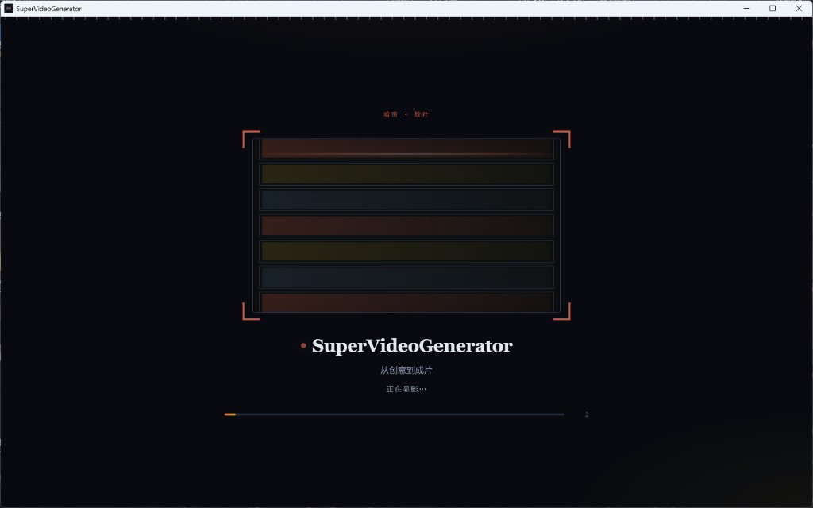

# 快速开始

> 更新日期：2026-07-21

Language: **中文** | [English](getting-started.en.md)

推荐使用**桌面端**。多数人只需下载安装包；从源码参与开发时，用仓库根目录的桌面启动脚本。装好并启动后，请阅读 **[用户手册 · 从零到成片](user-guide/01-first-video.md)**。

启动时会短暂显示暗房胶片开屏（「正在显影…」），随后进入项目列表。



*图1 启动页*

## 路径一：下载桌面安装包（推荐）

面向日常使用，无需自行安装 Python / Node。

1. 打开 [GitHub Releases](https://github.com/GodyuFF/SuperVideoGenerator/releases)，下载对应平台的安装包。
2. 按系统提示安装并启动应用。
3. 打开 [用户手册 · 从零到成片](user-guide/01-first-video.md)；API Key 在应用内 **「AI 配置」** 中填写（自备 Key；仅保存在本机）。

安装包默认**未代码签名**。Windows SmartScreen 或 macOS Gatekeeper 可能提示拦截，属预期；按系统提示允许运行即可。更多说明见 [apps/desktop/README.md](../apps/desktop/README.md)。

## 路径二：从仓库启动桌面开发壳

面向贡献者或需要改代码的用户。需本机已安装 **Python 3.11+**、**Node.js 18+**（FFmpeg 可选）。

虚拟环境（`.venv`）**不会**随 Git 下发，克隆后须在本机重建。

### 一次性依赖

```bash
python -m venv .venv
.venv\Scripts\activate          # Windows；macOS/Linux: source .venv/bin/activate
pip install -r requirements.txt
cd apps/web && npm install && cd ../..
cp .env.example .env            # 可选：也可稍后在应用内 AI 配置中填写
```

也可在应用 **「AI 配置」** 页填写 Key，持久化至 `data/ai_config.json`（仅本机）。

### 启动桌面（推荐）

在仓库根目录：

```bat
launch-desktop.vbs
```

或带控制台日志：`launch-desktop.bat`。亦可 `cd apps/desktop && npm start`。

开发壳会拉起本机 API + 前端并打开 Electron 窗口；**不**捆绑 Python/Node，依赖上述本机环境。细节见 [apps/desktop/README.md](../apps/desktop/README.md)。

启动后请继续：[用户手册 · 从零到成片](user-guide/01-first-video.md)。完整章节见 [用户手册目录](user-guide/README.md)。

## 可选：浏览器开发模式

仅在调试 Web/API、不需要 Electron 时使用：

```bash
.venv\Scripts\python.exe -m uvicorn apps.api.main:app --host 0.0.0.0 --port 8000
cd apps/web && npm run dev
```

打开 [http://localhost:5173](http://localhost:5173)。

## 维护者：本地打安装包

```powershell
.\apps\desktop\packaging\build-desktop.ps1
```

产物与发布流程见 [apps/desktop/README.md](../apps/desktop/README.md)。

---

返回 [文档目录](README.md) · [用户手册](user-guide/README.md) · 仓库简介 [README.md](../README.md) / [README.en.md](../README.en.md)
