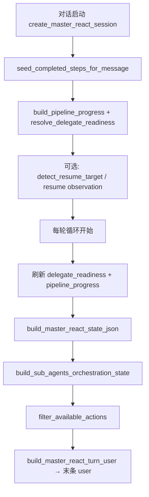

# 主编排「当前编排状态」组装逻辑

> 更新日期：2026-07-16  
> 相关代码：`core/llm/react_decide.py`、`core/llm/prompt/builder.py`、`core/llm/master/session.py`、`core/llm/master/pipeline_progress.py`、`core/llm/master/delegate_deps.py`、`core/llm/master/delegate_tool.py`  
> 提示词注入位置见 [prompt-architecture.md](prompt-architecture.md) §3 / §4

本文说明每轮主编排 ReAct 决策前，注入到 **messages 末条 user** 的 `## 当前编排状态` JSON 如何从会话、Store、风格与 Profile 组装而成。

---

## 1. 注入形态

每轮 `decide_master_session` 组装 LLM 请求时：

```
system  = build_react_static_system(角色固定区)     # 不含可变状态
tools   = build_master_react_tools(available_actions)
history = build_master_react_chat_history(...)
turn_user = build_master_react_turn_user(session)  # ← 编排状态
```

`turn_user` 结构（`build_react_state_turn_content`）：

```
## 当前编排状态
{ JSON }

已完成：…；当前可委派 agent_id：…；next_actions：…。
必须通过 tool_calls 调用 available_actions 中的函数；…

说明（每轮决策前必读）：
1. …（MASTER_STATE_INSTRUCTIONS）
```

JSON 本体由 `build_master_react_state_json` → `build_react_state_json` 生成。

---

## 2. 组装流水线（时序）



| 阶段 | 入口 | 写入 |
|------|------|------|
| 会话创建 | `create_master_react_session` | `task_brief`、`tools`、`sub_agents` 规格、`extra` 基础字段（style/generation/execution/profile） |
| 启动 seed | `MasterReActOrchestrator` 首轮前 | `completed_step_types` ← Store 推断；`pipeline_progress` / `delegate_readiness`；可选 `user_resume_target` |
| 每轮刷新 | ReAct 循环开头 | 重新扫描 Store → 更新 `delegate_readiness`、`pipeline_progress`、`execution_plan` |
| 拼 prompt | `build_master_react_state_json` | 合并 session + extra + `sub_agents` / `available_sub_agents` / `next_actions` |

---

## 3. 字段来源一览

### 3.1 顶层固定槽位（`build_react_state_json`）

| 字段 | 组装函数 / 来源 | 说明 |
|------|-----------------|------|
| `task_brief` | `ReActSession.task_brief` | 创建会话时写入的固定说明（选 delegate / tool / finish、Store 复用规则） |
| `available_actions` | `session.available_actions()` → `filter_available_actions` | `delegate_agent`（若 roster 有候选）+ 主编排 tools + `finish`；非 goal 模式加 `ask_user_question`；再经 skill overlay / tool override；一次性已完成项剔除 |
| `completed_actions` | `session.completed_labels()` | `step:{step_type}` + `tool:{name}`；空则 `["无"]` |
| `observations` | `prepare_master_context` | 有 chat history 时通常不注入；否则带压缩后的 observation 列表 |

### 3.2 session.extra 透传字段

| 字段 | 写入时机 | 来源 |
|------|----------|------|
| `style_mode` / `generation_mode` / `execution_mode` / `prompt_profile_id` | 创建会话 | 用户/项目配置 |
| `style_hints` | 启动时若 Script 有提示 | `format_style_hints_line(script.style_hints)` |
| `pipeline_progress` | 启动 + 每轮 | `build_pipeline_progress(store, script_id, style_mode)` |
| `delegate_readiness` | 启动 + 每轮 | `resolve_delegate_readiness(...)`（与 progress 内同结构，顶层再挂一份便于读取） |
| `user_resume_target` | 启动时若命中 | `detect_resume_target_step(user_message)` |
| `skill_overlay` | 本轮 `/skillId` | 影响 `available_actions` 过滤 |
| `history_summary` | 无 chat history 路径且超窗 | `prepare_master_context` |

### 3.3 状态 JSON 内再计算字段

| 字段 | 组装 | 说明 |
|------|------|------|
| `next_actions` | `session.next_actions()` | 有未完成且无硬拦的子 Agent → `["delegate_agent"]`；续跑剪辑且 `ready_for_edit_compose` 时同样推荐委派 |
| `sub_agents` | `build_sub_agents_orchestration_state` | 每 agent 一行：职责 + ready/soft/hard + `completed` + `available` |
| `available_sub_agents` | 同上 | `available=true` 的 agent_id（未完成且无 hard_blockers）；与 `delegate_agent` tool schema enum 对齐 |
| `execution_plan` | `build_plan_snapshot(plan)` | PlanDocument 快照（version/goal/constraints/steps） |
| `plan_status_history` / `last_remaining_plan` | 会话累计 | LLM 回写的 plan 跟踪（非空才注入） |

---

## 4. Store 完成态与 completed_actions

### 4.1 推断（事实层）

`infer_completed_step_types(store, script_id, style_mode)` 按 Store 素材判定：

| step_type | 完成条件（摘要） |
|-----------|------------------|
| `script_design` | Script.content_md 非空，或存在 plot/narration/角色/场景/道具/frame 等文字资产 |
| `storyboard` | 存在 VideoPlan 且 `shots` 非空 |
| `image_gen` | 图文管线：视觉文字资产均有 ready 图，且子镜 frame 关联齐全 |
| `tts_gen` | 需配音的镜头均有可访问 AUDIO media |
| `shot_detail` | `is_shot_detail_complete` |
| `video_gen` | 仅 AI 视频：子镜 video_clip 齐全且视频 media 可访问 |
| `edit_compose` | 已有 EditTimeline 或可访问 FINAL media |

写入 `pipeline_progress.inferred_completed_steps`（排序列表）。

### 4.2 Seed（本对话完成态）

`seed_completed_steps_for_message`：

1. 用户说「全部重做」等 → 返回空集（不复用）。
2. 否则以 `inferred_completed_steps` 为起点。
3. `detect_reopen_steps` 命中明确重做/续跑（如「重新配音」「从剪辑继续」）→ 剔除该步及 `_DOWNSTREAM_INVALIDATE` 下游。
4. 结果写入 `session.completed_step_types` → 状态 JSON 的 `completed_actions`（`step:script_design` 形式）。

**注意**：`inferred_completed_steps` 反映 Store 事实；`completed_actions` 反映本对话是否允许再委派该步。二者可因用户重开意图而不同。

---

## 5. pipeline_progress

`build_pipeline_progress` 输出：

| 键 | 含义 |
|----|------|
| `inferred_completed_steps` | §4.1 |
| `gaps` | `_edit_compose_gaps`：剪辑前缺口（缺分镜/配图/配音/详设等） |
| `ready_for_edit_compose` | gaps 为空且上游齐备（图文：配图+TTS+详设；AI 视频：video+详设） |
| `eligible_delegates` | 有未完成无硬拦 agent 时为 `["delegate_agent"]`，否则 `[]` |
| `delegate_readiness` | 与顶层同构的就绪表 |
| `delegates_for_style` | 当前风格若有可委派步则为 `["delegate_agent"]` |

---

## 6. delegate_readiness 与 soft / hard

`resolve_delegate_readiness` 遍历 `build_delegate_agent_candidates`（Profile roster ∩ 风格 steps）：

- `ready = 无 soft_blockers 且 无 hard_blockers`
- **hard**：风格禁止（如非 AI 视频不可 `video_gen`）→ 该 agent 不会进入 `available_sub_agents`
- **soft**：依赖未满足时的中文提示，**仍可委派**（`available=true`），仅提示风险

典型 soft 规则（`_resolve_blockers`）：

| step | 示例 soft |
|------|-----------|
| `image_gen` | 无待生图文字资产 |
| `storyboard` | 缺剧本/文字资产 |
| `tts_gen` / `video_gen` | 缺 VideoPlan |
| `shot_detail` | 缺分镜 / TTS / 配图；AI 视频另缺 video |
| `edit_compose` | `_edit_compose_gaps` 前几条 + 详设未完成 |

`sub_agents[].available` = 未在 `completed_step_types` 中 **且** 无 hard_blockers（与 soft 无关）。

`sub_agents[].completed` = `step_type ∈ completed_step_types`（已 completed 的 agent `available=false`，故你给的样例里 `script_agent.available=false`）。

---

## 7. available_actions 与 next_actions

### 7.1 available_actions

```
[delegate_agent?] + tool_* + finish [+ ask_user_question]
  → skill_overlay 过滤
  → master tool override
  → filter_available_actions（剔除已完成的一次性 action）
```

主编排 tools 典型：`tool_get_plan_summary`、`tool_list_assets`、`tool_read_webpage`。

### 7.2 next_actions

从 `delegate_readiness` 取「无 hard 且 step 未 completed」的 agent_id，按 ready 优先排序；若非空且允许委派 → `["delegate_agent"]`，否则 `[]`（提示文案回落为 `finish`）。

续跑：若 `user_resume_target` 对应 agent 仍在 pending，且（非剪辑 或 剪辑且 `ready_for_edit_compose`）→ 同样推荐 `delegate_agent`。

---

## 8. 样例解读（对照你提供的 JSON）

场景：`style_mode=ai_video`，Store 仅有剧本，用户未要求全部重做。

| 观察 | 推导 |
|------|------|
| `completed_actions: ["step:script_design"]` | seed 复用了 Store 剧本完成态 |
| `pipeline_progress.inferred_completed_steps: ["script_design"]` | 与 Store 一致 |
| `gaps: ["缺少 VideoPlan 分镜"]` | 剪辑前缺口从 storyboard 起算 |
| `ready_for_edit_compose: false` | 上游未齐 |
| `script_agent.completed=true, available=false` | 本对话不再开放剧本步 |
| `storyboard_agent.ready=true, available=true` | 剧本已有 → 分镜可立即委派 |
| `image_agent.ready=false` 但 `available=true` | soft：无待生图资产，仍允许委派 |
| `video/tts/refine/editing` soft 均为缺 VideoPlan | 可出现在 `available_sub_agents`，但不应优先于 storyboard |
| `next_actions: ["delegate_agent"]` | 仍有可委派候选 |
| `execution_plan.steps: []` | 启动 Plan 壳，步骤由后续 LLM plan 回写填充 |

一句话决策意图：**已完成剧本 → 优先 `delegate_agent(agent_id=storyboard_agent)`，勿重跑 script；其余下游等 VideoPlan 后再开。**

---

## 9. 关键模块索引

| 模块 | 职责 |
|------|------|
| `core/llm/master/session.py` | `ReActSession`、`available_actions` / `next_actions` / `completed_labels`、会话创建 |
| `core/llm/master/pipeline_progress.py` | Store 推断、seed、resume、gaps、`build_pipeline_progress` |
| `core/llm/master/delegate_deps.py` | soft/hard blockers、`resolve_delegate_readiness`、eligible 排序 |
| `core/llm/master/delegate_tool.py` | 候选 agent、`build_sub_agents_orchestration_state`、delegate tool schema/description |
| `core/llm/react_decide.py` | `build_master_react_state_json` / `build_master_react_turn_user` |
| `core/llm/prompt/builder.py` | `build_react_state_json`、`filter_available_actions`、turn 拼装 |
| `core/llm/prompt/chat_messages.py` | `MASTER_STATE_HEADER` / `MASTER_STATE_INSTRUCTIONS` |
| `core/llm/master/master_react.py` | 启动 seed + 每轮刷新 progress/readiness 后调用 decide |

---

## 10. 与子 Agent 状态的差异

| | 主编排 | 子 Agent |
|--|--------|----------|
| 标题 | `## 当前编排状态` | 同标题或行动上下文 |
| 特有字段 | `pipeline_progress`、`sub_agents`、`available_sub_agents`、`delegate_readiness`、`next_actions`、`execution_plan` | `plan_slice`、`project_context`、工具级 `available_actions` |
| 完成语义 | `step:*` 委派步 | 子 Agent 内部 tool 名（一次性/可重复） |

子 Agent 组装见 [prompt-architecture.md](prompt-architecture.md) §3.1「子 Agent」。
