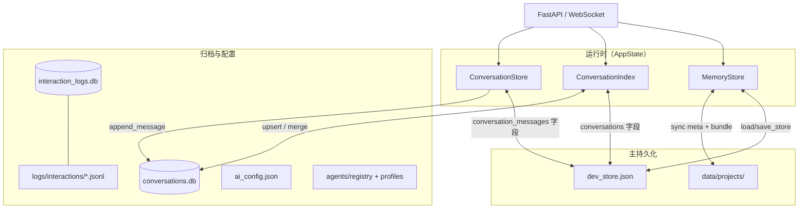
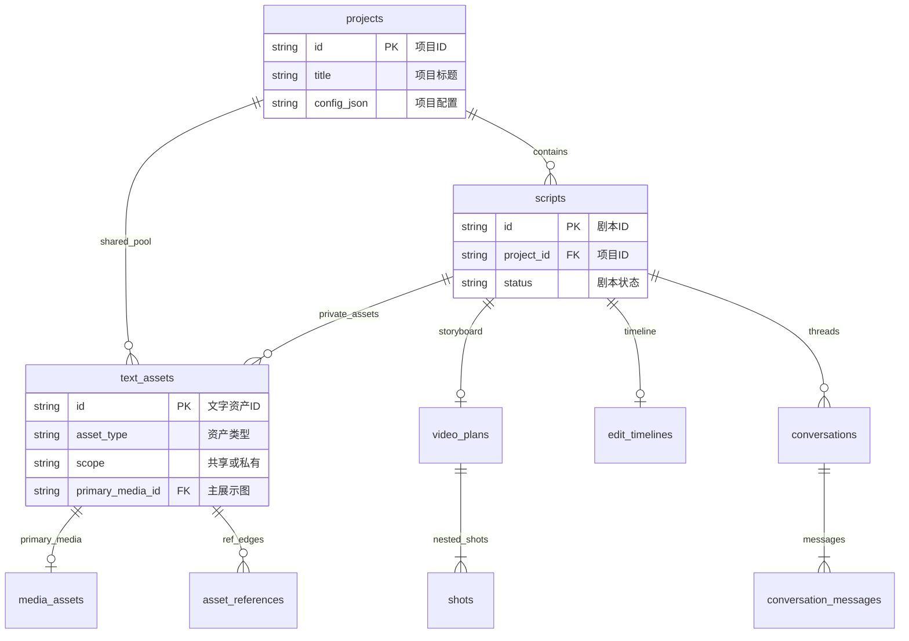

# SuperVideoGenerator 数据存储结构与关联关系

> 版本：v1.0  
> 更新日期：2026-07-14（子镜 produce_mode + 画面时段）
> 对应代码：`core/store/`、`core/models/`、`core/conversation/`、`core/interaction_log/`

---

## 目录

1. [总览](#1-总览)
2. [运行时内存模型（MemoryStore）](#2-运行时内存模型memorystore)
3. [领域实体与关联关系](#3-领域实体与关联关系)
4. [磁盘目录结构](#4-磁盘目录结构)
5. [各持久化层详解](#5-各持久化层详解)
6. [启动恢复与双写同步](#6-启动恢复与双写同步)
7. [删除与生命周期](#7-删除与生命周期)
8. [前端本地存储](#8-前端本地存储)
9. [环境变量与路径覆盖](#9-环境变量与路径覆盖)
10. [代码索引](#10-代码索引)

> 姊妹文档：[`data-storage-schema.md`](data-storage-schema.md)（**数据库表结构设计与 ER 关系图**）

---

SuperVideoGenerator 采用 **内存聚合 + 多文件/多库持久化** 架构：

| 层级 | 技术 | 职责 |
|------|------|------|
| **运行时** | `MemoryStore`（Python dict） | 项目、剧本、资产、计划、时间轴的统一读写入口 |
| **主索引** | `data/dev_store.json` | MemoryStore 全量 JSON 快照（含对话元数据） |
| **项目双写** | `data/projects/` 目录树 | 项目/剧本 meta、媒体文件、剧本级资产 bundle |
| **对话归档** | `data/conversations.db`（SQLite） | 完整对话消息 + A2UI 确认记录（append-only） |
| **交互日志** | `data/interaction_logs.db` + JSONL | LLM/HTTP/API 调用审计 |
| **全局配置** | `data/ai_config.json`、`data/agents/` | AI 服务密钥、Agent 提示词与工具配置 |
| **应用日志** | `data/logs/app.log` | 分阶段结构化运行日志 |



**设计原则**：

- 一切业务实体带全局唯一 `asset_id`（`{prefix}_{uuid12}`）
- 文字资产与数字资产分离；数字资产通过 `source_asset_id` / `generates` 边回溯来源
- 人物/道具/场景为**项目级共享池**；剧情/分镜/媒体默认**剧本私有**
- 未执行态支持全量 CRUD；`executing` 后资产锁定只读

---

## 2. 运行时内存模型（MemoryStore）

实现：`core/store/memory.py`

`MemoryStore` 是 API 与编排层的唯一数据源，内部为多个 `dict[str, Entity]`：

| 字段 | 实体类型 | 键规则 | 说明 |
|------|----------|--------|------|
| `projects` | `Project` | `project.id` | 项目根 |
| `scripts` | `Script` | `script.id` | 剧本（隶属项目） |
| `text_assets` | `TextAsset` | `asset.id` | 文字资产（character/prop/scene/frame/plot/narration） |
| `media_assets` | `MediaAsset` | `media.id` | 数字资产（image/video/audio/final） |
| `references` | `AssetReference` | `ref.id` | 显式引用边 |
| `plans` | `PlanDocument` | `{script_id}_v{version}` | ReAct 执行计划 |
| `_script_plans` | `str` | `script_id → plan_key` | 剧本当前 plan 指针 |
| `video_plans` | `VideoPlan` | `plan.id` | 分镜计划稿（含 Shot 镜内多轨） |
| `edit_timelines` | `EditTimeline` | `timeline.id` | 剪辑时间轴（投影自 VideoPlan 或手改） |

**查询方法职责分离**（共享池可见性，2026-07-16）：

| 方法 | 调用方 | 共享池范围 |
|------|--------|------------|
| `list_assets_for_script` | Agent `list_text_assets`、`load_context` | 本剧本私有 + **已关联**共享池 |
| `list_visible_text_assets_for_script` | 看板 Tab、`GET .../assets` | 同上 |
| `list_shared_assets` | `core/rag/retriever` | 同项目全部 `project_shared` |
| `list_media_for_script` | 媒体列表、编辑器 | 仅 `script_id` 匹配的媒体 |
| `list_media_for_project` | 项目级媒体总览 | 同 `project_id` 全部媒体 |

---

## 3. 领域实体与关联关系

实体定义：`core/models/entities.py`、`core/models/image_text_asset.py`

### 3.1 层级结构

```
Project（项目）
├── ProjectConfig（generation / style / image_text / agents / **rag**）
├── SharedAssetPool（scope = project_shared）
│   ├── TextAsset: character
│   ├── TextAsset: prop
│   └── TextAsset: scene
└── Script × N
    ├── Script 元数据（status、style_mode、content_md…）
    ├── TextAsset: plot / narration / frame（script_private）
    ├── PlanDocument（主编排执行计划）
    ├── VideoPlan
    │   └── Shot × M（镜内多轨：visuals / video_tracks / audio_tracks / subtitles）
    ├── EditTimeline（全片剪辑时间轴，可投影自 Shot）
    ├── MediaAsset: image / video / audio / final
    └── Conversation × N（对话线程，独立索引）
```

### 3.2 ID 前缀规范

生成函数：`new_id(prefix)` → `{prefix}_{uuid.hex[:12]}`

| 前缀 | 实体 | 存储位置 |
|------|------|----------|
| `proj_` | Project | `projects` |
| `script_` | Script | `scripts` |
| `txt_` | TextAsset | `text_assets` |
| `media_` | MediaAsset（含 image/video/audio/final） | `media_assets` |
| `ref_` | AssetReference | `references` |
| `plan_` | VideoPlan | `video_plans` |
| `shot_` | Shot | 嵌套于 `VideoPlan.shots` |
| `vis_` | ShotSubShot | 嵌套于 `Shot.sub_shots` |
| `svc_` | ShotVideoClip | 嵌套于 `Shot.video_tracks` |
| `svt_` | ShotVideoTrack | 嵌套于 `Shot.video_tracks` |
| `sac_` | ShotAudioClip | 嵌套于 `Shot.audio_tracks` |
| `sat_` | ShotAudioTrack | 嵌套于 `Shot.audio_tracks` |
| `ssub_` | ShotSubtitle | 嵌套于 `Shot.subtitles` |
| `etl_` | EditTimeline | `edit_timelines` |
| `clip_` | EditClip | 嵌套于 `EditTimeline` |
| `vly_` | EditVideoLayer | 嵌套于 `EditTimeline.video_layers` |
| `step_` | PlanStep | 嵌套于 `PlanDocument.steps` |
| `var_` | ImageVariant | 嵌套于 `TextAsset.content.image_variants` |
| `conv_` | Conversation | `ConversationIndex` / SQLite |
| `msg_` | ConversationMessage | `ConversationStore` / SQLite |
| `conf_` | A2UI confirmation_id | SQLite `a2ui_records` |
| `ilog_` | InteractionRecord | `interaction_logs` |

> **说明**：产品手册中的 `img_`/`vid_`/`tts_`/`fin_` 为语义分类；**实际落盘统一使用 `media_` 前缀**，通过 `MediaAsset.type` 区分类型。

### 3.3 文字资产（TextAsset）

| 字段 | 类型 | 说明 |
|------|------|------|
| `id` | str | `txt_*` |
| `project_id` | str | 所属项目 |
| `script_id` | str \| null | `script_private` 时必填 |
| `scope` | `project_shared` \| `script_private` | 共享池 vs 剧本私有 |
| `type` | character/prop/scene/frame/plot/narration | 资产类型 |
| `name` | str | 显示名 |
| `content` | dict | 结构化内容（图文资产见 `image_text_asset.py`） |
| `status` | draft/ready/locked/generated/archived | 生命周期 |
| `user_edited` | bool | UI 手工修改标记 |
| `source_script_id` | str \| null | 共享资产首次创建来源剧本 |
| `primary_media_id` | str \| null | 主展示图（base 变体 media） |
| `reuse_policy` | shared \| private | 复用策略 |

**图文资产 content 要点**（character/prop/scene/frame）：

- 共用：`summary`、`description`、`image_prompt`、`image_variants[]` 等
- `image_variants[]`：`ImageVariant`（base/expression/pose/action…）→ `media_id`
- frame 特有：`element_refs`（引用 scene/character/prop）、`variant_refs`（关联资产 → 子形象 id）、`shot_id`
- 图文共用亦可存 `variant_refs`；`video_clip` 同理
- character 特有：`tts_voice`（音色，供 TTS 多角色配音）

> **voice_role**：产品规划中的「声音角色」当前**未独立建模**；运行时由 character 的 `content.tts_voice` 与分镜 `ShotAudioClip.character_ref` 表达。

### 3.4 数字资产（MediaAsset）

| 字段 | 类型 | 说明 |
|------|------|------|
| `id` | str | `media_*` |
| `project_id` | str | 所属项目 |
| `script_id` | str \| null | 默认剧本私有 |
| `type` | image/video/audio/final | 媒体类型 |
| `name` | str | 显示名 |
| `url` | str | 相对路径 `projects/.../assets/media/{id}.{ext}` 或 API URL |
| `source_asset_id` | str \| null | 溯源文字资产 ID |
| `status` | AssetStatus | 同文字资产 |
| `metadata` | dict | `duration_ms`、`shot_id`、`superseded` 等扩展 |

### 3.5 引用关系（AssetReference + 隐式边）

显式边：`MemoryStore.references`（`AssetReference`）

| 字段 | 说明 |
|------|------|
| `source_id` | 引用方（script、text、shot 等） |
| `target_id` | 被引用方 |
| `relation` | 关系类型 |
| `script_id` | 可选，剧本上下文 |

**RelationType 枚举**（`references` 表）：

| relation | 含义 |
|----------|------|
| `uses` | 剧本/剧情/分镜引用某资产 |
| `derived_from` | 派生自共享资产（fork） |
| `rag_reuse` | RAG 复用审计 |
| `generates` | 文字资产 → 数字资产 |
| `voice_of` | 声音绑定角色 |

**隐式边**（由 `core/assets/lineage.py` 在查询时合并，不单独落盘）：

| 来源 | relation |
|------|----------|
| `Shot.sub_shots[].element_refs` | `element_ref` / `shot_ref` |
| `FrameContent.element_refs` | `element_ref` |
| `*.variant_refs` | 关联资产指定子形象（生图/生视频参考图） |
| `MediaAsset.source_asset_id` | `generates` |
| Script → VideoPlan | `has_plan` |
| Script → plot TextAsset | `has_plot` |

谱系查询 API：`resolve_descriptor`、`build_lineage`、`build_project_graph`。

### 3.6 分镜与剪辑（VideoPlan / Shot / EditTimeline）

**VideoPlan**（`plan_*`）：

- `script_id`：一对一（每剧本至多一个活跃 VideoPlan）
- `shots[]`：有序分镜列表
- `mode`：storybook / ai_video

**Shot**（镜内多轨，时长由配音/素材驱动、无硬上限）：

```
Shot
├── sub_shots[]          # 设计层：挂接 frame（images）/ video_clip（videos）；produce_mode + 各 images[].start_ms/end_ms
├── video_tracks[]     # 剪辑层：ShotVideoClip（source_kind: still | video）
├── audio_tracks[]     # 角色音/背景音：ShotAudioClip（character_ref → 角色语音，非子镜挂接）
└── subtitles[]        # 镜内字幕（text / start_ms / end_ms / character / color）
```

时段与意图解析/校验：[`core/edit/sub_shot_produce.py`](../../../core/edit/sub_shot_produce.py)（画面 `0+0` 回填子镜区间；缺 `produce_mode` 时按 `videos`/`images[].kind=video` 推断 `img2video`；历史 `still_edit`/`ai_video`/`hybrid` 读入规范为三值）。

挂接边界见 [`product-plan.md`](product-plan.md)「分镜挂接与角色边界」：子镜槽位仅 `frame` / `video_clip`；角色仅配音幕 `character_ref`。

投影：`core/edit/shot_flatten` → `EditTimeline`（供 OpenCut / FFmpeg）

**EditTimeline**（`etl_*`）：

- `tracks`：audio / subtitle 轨
- `video_layers[]`：多轨视频叠加（`z_index`）
- `source_refs`：关联 shot_id、text_asset_ids、media_ids
- `user_edited` / `last_edited_by`：手改保护

### 3.7 对话（Conversation）

| 组件 | 存储 | 说明 |
|------|------|------|
| `ConversationIndex` | 内存 + `dev_store.conversations` | 对话元数据（title、token 统计） |
| `ConversationStore` | 内存 + `dev_store.conversation_messages` | 按 channel 隔离的消息 |
| `ConversationSqliteStore` | `conversations.db` | 完整归档（含 ReAct 轮、子 Agent） |

消息 channel 键：`{conversation_id}:master` 或 `{conversation_id}:agent:{agent_name}`

### 3.8 实体关系图

**含完整属性与中文含义的 ER 图**见 [`data-storage-schema.md` §8](data-storage-schema.md#8-全局-er-关系图含属性与中文含义)。

以下为结构总览（关系标签为中文，属性详见 schema 文档）：



---

## 4. 磁盘目录结构

根目录：`data/`（可由 `SVG_DATA_ROOT` 覆盖）

```
data/
├── dev_store.json                 # MemoryStore 主索引 + 对话快照
├── ai_config.json                 # LLM/生图/生视频/TTS/导出/Embedding 配置
├── conversations.db               # 对话消息 + A2UI 归档（SQLite WAL）
├── interaction_logs.db            # 交互日志（SQLite WAL）
├── agents/
│   ├── registry.json              # Profile/风格/全局 tool_overrides
│   └── profiles/
│       ├── default/workspace.json
│       ├── storybook/workspace.json
│       ├── ai_video/workspace.json
│       └── {custom_profile}/workspace.json
├── logs/
│   ├── app.log                    # 应用运行日志（轮转）
│   └── interactions/
│       └── {project_id}/
│           └── {YYYY-MM-DD}.jsonl # 交互日志 JSONL 镜像
└── projects/
    └── {project_id}/
        ├── project.json           # Project 元数据快照
        ├── rag/
        │   └── embeddings.sqlite  # 共享池 character/scene/prop 向量索引
        └── scripts/
            └── {script_id}/
                ├── script.json    # Script 元数据快照
                ├── store_bundle.json  # 剧本级资产 bundle
                └── assets/
                    ├── media/     # 图片/视频/音频文件
                    │   └── {media_id}.{ext}
                    └── exports/   # FFmpeg 成片 / NLE 导出
                        └── {filename}
```

**媒体 URL 约定**：

- 落盘路径：`projects/{pid}/scripts/{sid}/assets/media/{media_id}.{ext}`
- API 访问：`GET /api/projects/{pid}/scripts/{sid}/assets/media/{filename}`
- 成片路径：`projects/.../assets/exports/...`

---

## 5. 各持久化层详解

### 5.1 dev_store.json

模块：`core/store/persist.py`

**顶层字段**：

```json
{
  "projects": { "proj_xxx": { ... } },
  "scripts": { "script_xxx": { ... } },
  "text_assets": { "txt_xxx": { ... } },
  "media_assets": { "media_xxx": { ... } },
  "references": { "ref_xxx": { ... } },
  "plans": { "script_xxx_v1": { ... } },
  "script_plans": { "script_xxx": "script_xxx_v1" },
  "video_plans": { "plan_xxx": { ... } },
  "edit_timelines": { "etl_xxx": { ... } },
  "conversations": { "conv_xxx": { ... } },
  "conversation_messages": {
    "conv_xxx:master": [ { ... } ],
    "conv_xxx:agent:script_agent": [ { ... } ]
  }
}
```

**写入策略**：

- `schedule_save`：防抖 0.5s；关键 mutation 可 `immediate=True`
- 执行中（`ScriptStatus.EXECUTING`）：合并落盘（默认 3s 合并，避免锁竞争）
- 环境变量 `SVG_PERSIST_STORE=0` 可禁用

### 5.2 store_bundle.json（剧本级双写）

模块：`core/store/asset_disk_sync.py`

每剧本一份，用于 `dev_store.json` 丢失后的稀疏恢复：

| 字段 | 内容 |
|------|------|
| `text_assets` | 该剧本可见文字资产 |
| `media_assets` | 该剧本媒体元数据 |
| `references` | 相关引用边 |
| `video_plans` | 分镜计划 |
| `edit_timelines` | 剪辑时间轴 |
| `plans` / `script_plans` | ReAct 计划 |

合并策略：**仅补充** `dev_store` 中缺失的 ID，不覆盖已有条目。

### 5.3 project.json / script.json

模块：`core/store/project_paths.py`

- `save_store` 时调用 `sync_all_meta` 双写
- 启动时 `discover_projects_from_disk` 补齐缺失项目/剧本
- `sync_scripts_from_disk` 合并磁盘较新的 `content_md`、status 等

### 5.4 conversations.db

模块：`core/conversation/sqlite_store.py`

| 表 | 用途 |
|----|------|
| `conversations` | 对话元数据、token 统计 |
| `conversation_messages` | 全量消息（含 ReAct tool_use/tool 轮、`step_id`） |
| `a2ui_records` | A2UI 确认请求与响应 |

索引：`idx_conv_msg_conv_time`、`idx_conv_msg_agent`、`idx_a2ui_conv_time`

**同步方向**：

- 启动：SQLite → `ConversationIndex`（补全缺失元数据）
- 运行时：每条新消息 `append_message` 写入 SQLite；`persist_store` 额外 `backfill_messages` 兜底（对 `messages`/`conversations` 做 `list(...values())` 快照后再迭代，避免 `persist_store_async` 线程池落盘时与主线程 `setdefault` 并发改写触发 `dictionary changed size during iteration`）
- `dev_store.json` 含 `conversations` / `conversation_messages` 双写备份（经 `configure_persist_hooks` 注册 `ConversationStore`）
- 数据库路径固定为 `DATA_ROOT/conversations.db`（与 `dev_store.json` 同根，避免 cwd 漂移）
- **pytest 会话隔离**：`tests/support/data_isolation.rebind_conversation_storage()` 在 `rebind_data_root` 后重绑 AppState SQLite，防止 `clear_all()` 误删真实 `data/conversations.db`

### 5.5 interaction_logs

模块：`core/interaction_log/store.py`、`file_store.py`、`async_writer.py`

| 存储 | 说明 |
|------|------|
| SQLite `interaction_logs` | 主查询源；`PRAGMA journal_mode=WAL` |
| JSONL | `data/logs/interactions/{project_id}/{date}.jsonl` 镜像 |

**kind 类型**：`llm_request`、`llm_response`、`llm_error`、`conversation_token_round`、`agent_action`、`api_request`

启动 retention：默认删除 30 天前的 `api_request` 记录。

### 5.6 ai_config.json

模块：`core/llm/ai_config_store.py`

分区：`llm`、`image`（含 `pipeline`）、`video`、`tts`、`export`、`embedding`

含 API Key 等敏感字段；JSON 优先于 `.env` 覆盖内存配置。

`embedding`：OpenAI 兼容 Embedding（`api_key` / `base_url` / `model` / `enabled`）。未配置 Key 时共享资产创建回退为规范化名称精确匹配（见 `core/rag/name_match.py`）。

### 5.7 agents/ 配置

模块：`core/llm/agent/config_manager.py`、`config_paths.py`

| 文件 | 内容 |
|------|------|
| `registry.json` | `custom_profiles`、`style_modes`、`prompt_profiles`、`tool_overrides` |
| `profiles/{id}/workspace.json` | `agent_roster`、`prompt_content`、`tool_overrides`、`custom_agents` |

内置两风格 Profile（storybook/ai_video）出厂 seed 于 `core/llm/agent/seeds/profiles/`。

---

## 6. 启动恢复与双写同步

`AppState.__init__` 调用链（`apps/api/state.py`）：

```
load_store(MemoryStore)
  ├─ 读取 dev_store.json → 填充全部 dict
  ├─ merge_script_bundles_from_disk（补缺失资产）
  ├─ discover_projects_from_disk（补缺失项目/剧本 meta）
  └─ sync_scripts_from_disk（合并较新 script.json）
  → 若有变更则回写 dev_store.json

_sync_conversation_stores()
  ├─ SQLite → ConversationIndex merge
  └─ 内存消息 → SQLite backfill

_recover_stuck_executing_scripts()
  └─ 无活跃任务时 executing → failed
```

**磁盘扫描跳过**（性能优化）：

- `dev_store.json` 5 分钟内更新且已含资产索引 → 跳过全量扫描
- `SVG_SKIP_DISK_SCAN=1` 强制跳过

---

## 7. 删除与生命周期

| 操作 | 清理范围 | 保留 |
|------|----------|------|
| `DELETE /api/projects/{id}` | MemoryStore、dev_store、conversations.db、data/projects/{id}/ | interaction_logs |
| `DELETE .../scripts/{sid}` | 剧本级资产、bundle、媒体目录、对话 | 交互日志 |
| `DELETE /api/interactions?project_id=&date=` | SQLite + JSONL 指定日期 | 其他日期 |
| 新建项目 | 无历史清理 | 全部交互日志 |

**级联删除顺序**（`MemoryStore.delete_script`）：

1. 引用边（`references`）
2. 文字资产、媒体资产
3. PlanDocument、VideoPlan、EditTimeline
4. Script 实体
5. 磁盘：`remove_script_dir` / `remove_project_dir`

**删除守卫**：存在外部 `uses` 等引用时 `DELETE .../assets/{id}` 返回 409。

---

## 8. 前端本地存储

浏览器 `localStorage`（不入后端 `data/`）：

| 键 | 用途 |
|----|------|
| `svg.locale` | 界面语言（zh-CN / en） |
| `svf-theme` | 主题（浅色/深色/系统） |
| `svg_recent_projects` | 最近打开项目列表（最多 20） |
| `svg_active_session` | 当前工作台会话（projectId/scriptId/workspaceMode） |
| `svg_last_conversation:{projectId}:{scriptId}` | 剧本上次对话 ID |
| OpenCut 相关 | 编辑器快捷键、changelog、storage 提示等 |

---

## 9. 环境变量与路径覆盖

| 变量 | 默认值 | 说明 |
|------|--------|------|
| `SVG_DATA_ROOT` | `{repo}/data` | 数据根目录 |
| `SVG_PERSIST_STORE` | `1` | `0`/`false` 禁用 dev_store 持久化 |
| `SVG_SKIP_DISK_SCAN` | — | `1` 跳过启动磁盘扫描 |
| `SVG_EXECUTION_SAVE_COALESCE_SEC` | `3.0` | 执行中落盘合并间隔 |
| `SVG_AGENTS_ROOT` | `data/agents` | Agent 配置根目录 |
| `LOG_FILE` | `data/logs/app.log` | `off` 关闭文件日志 |

---

## 10. 代码索引

| 主题 | 路径 |
|------|------|
| 领域实体 | `core/models/entities.py` |
| 图文资产 content | `core/models/image_text_asset.py` |
| 内存仓储 | `core/store/memory.py` |
| JSON 持久化 | `core/store/persist.py` |
| 项目目录布局 | `core/store/project_paths.py` |
| 剧本 bundle | `core/store/asset_disk_sync.py` |
| 媒体落盘 | `core/store/media_storage.py` |
| 资产谱系 | `core/assets/lineage.py` |
| 对话存储 | `core/conversation/store.py`、`sqlite_store.py` |
| 交互日志 | `core/interaction_log/` |
| AI 配置 | `core/llm/ai_config_store.py` |
| Agent 配置 | `core/llm/agent/config_manager.py` |
| 应用状态 | `apps/api/state.py` |

---

## 变更记录

| 日期 | 说明 |
|------|------|
| 2026-07-12 | 初版：梳理 MemoryStore、磁盘双写、SQLite 归档、实体关联与恢复流程 |
