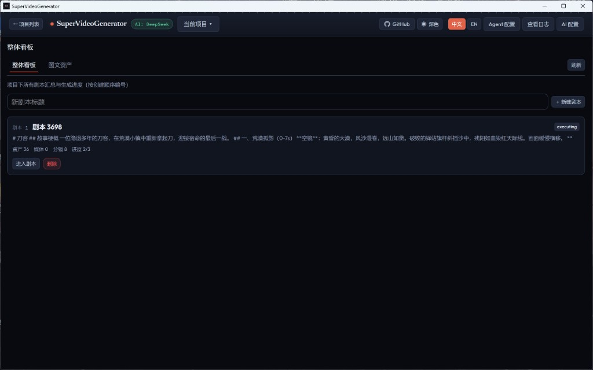

# 从零到成片

> 更新日期：2026-07-21

本章带你在应用已打开的前提下，用默认 **故事书模式** 做出第一条成片。只需 LLM + 生图 + TTS，不必开通 AI 视频 API。

安装与启动见 [快速开始](../getting-started.md)。

## 1. 配置 AI（最小可用）

1. 顶栏点击 **「AI 配置」**。
2. **LLM**：选择服务商与模型，填写 API Key，勾选启用 LLM ReAct，确认状态为「LLM 已配置」。
3. **图片**：保持启用 AI 生图，填写所选服务商的 API Key。
4. **TTS**：默认 **edge** 即可（一般无需 Key）。
5. **视频**：首次可保持关闭（故事书用静图合成，不依赖视频模型）。
6. 点击 **「保存并返回对话」**。

未配置时工作台会提示 **「去配置 AI」**；也可把 Key 写在仓库根目录 `.env`（参考 `.env.example`），效果等价。更细的各 Tab 说明见 [AI 配置](02-ai-config.md)。

## 2. 新建项目与剧本

进入应用后首先看到 **「项目列表」**（首页英雄区下方为 **「我的项目」**）。顶栏可进入 **「AI 配置」**、切换语言/主题等。

*图2 项目列表*

1. 在 **「我的项目」** 点击 **「＋ 新建项目」**，进入该项目的 **「整体看板」**（剧本列表）。
2. 在整体看板输入标题，点击 **「＋ 新建剧本」**，再点 **「进入剧本」**。
3. 进入剧本后，左侧出现 **「对话」** 面板（仅建项目、未进剧本时不会出现对话）。

*图3 剧本列表（整体看板）*

整体看板汇总项目下各剧本与进度；同页还有 **「图文资产」** Tab。卡片上可看到资产数、分镜数、进度，以及 **「进入剧本」** / **「删除」**。

## 3. 用对话做出第一条视频

1. 对话区上方：**视频风格** 选 **故事书模式**；保持 **目标模式** 关闭（便于逐步确认）。
2. （可选）选择图片风格、预计时长；**首次发送后风格会锁定，不可更改**。
3. 在输入框用自然语言描述创意（题材、受众、时长、画面感觉即可），点击 **「发送」**。
4. 出现确认卡片时，按提示选择 **「继续」** / **「重新生成」** / **「中止」**；有待确认时输入框会锁定。
5. 右侧 **「执行计划」** 会显示子 Agent 步骤与进度；等待剧本 → 分镜 → 生图 → 配音 → 剪辑规划跑完。

目标模式适合熟悉流程后的批量生产：开启后 AI 自主执行、少弹确认，首次不建议开。详见 [对话与执行计划](03-chat-and-plan.md)。

## 4. 检查看板与导出成片

1. 右侧 Tab 查看 **「剧本详情」**、**「角色」** / **「空镜」**、**「分镜」** 等；可在分镜胶片条或表格中点开单镜微调旁白、字幕。
2. 计划完成后打开 **「剪辑」** Tab，预览时间轴；需要精修时点 **「剪辑修改」** 进入专业剪辑。
3. 在剪辑助手顶栏点 **「导出」**，选择参数后得到 MP4，即第一条成片。

进阶：跑通故事书后再试 **「AI 视频模式」** / **「画面图生视频」**（须在 AI 配置的 **「视频」** Tab 启用并填写视频 API Key）。见 [视频风格与模式](06-modes.md)。

---

[手册目录](README.md) · 下一章：[AI 配置](02-ai-config.md)
