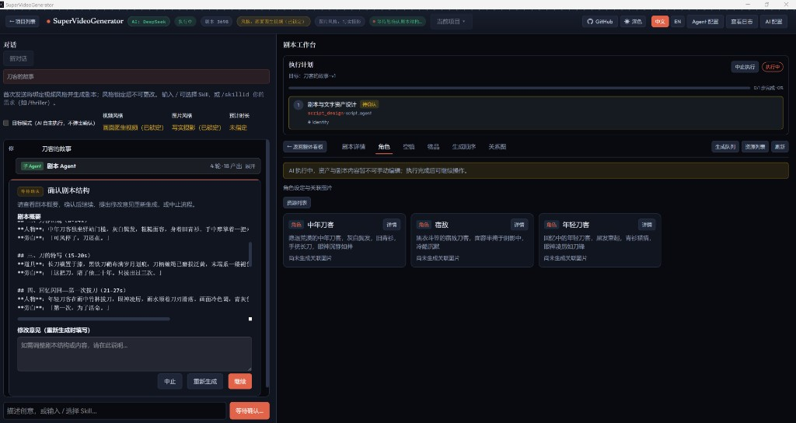
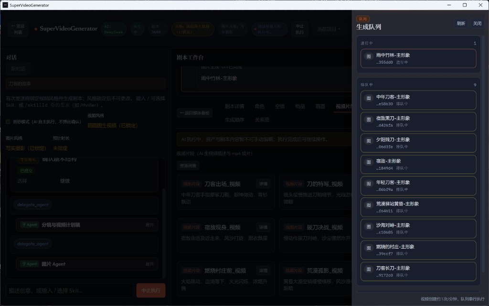

# 对话与执行计划

> 更新日期：2026-07-22

本章说明左侧 **「对话」** 如何驱动生产，以及右侧 **「执行计划」** 与确认卡片的用法。

前提：已进入某个剧本（仅建项目、未进剧本时不会出现对话面板）。

进入剧本后，左侧为 **「对话」**，右侧为 **「执行计划」** 与剧本工作台各 Tab。出现确认卡片时，底部输入会显示 **「等待确认…」**。

*图4 对话页面（含确认卡片与执行计划）*

## 发送前：风格与模式

对话区上方可设置：

| 控件 | 说明 |
|------|------|
| **视频风格** | 如 **「故事书模式」**、**「AI 视频模式」**、**「画面图生视频」** 等；决定编排与成片路径 |
| **图片风格** / **预计时长** | 可选提示，会随风格一并交给 AI |
| **目标模式** | 勾选后 AI 更自主、少弹确认；熟悉流程前建议关闭 |

提示文案：**「首次发送将绑定视频风格并生成剧本；风格锁定后不可更改。」**

锁定后界面会显示类似「故事书模式（已锁定）」；若需换风格，请新建剧本再选。

## 确认卡片

编排过程中可能弹出确认（计划确认、费用预估、澄清问题等）。常见操作：

- **「继续」** / **「确认并继续」** — 接受当前结果并往下走
- **「重新生成」** — 可按提示填写修改意见后重来
- **「中止」** — 停止本次执行

有待确认时输入框会锁定（显示「等待确认…」），处理完卡片后再继续聊天。

## 执行计划面板

右侧 **「执行计划」** 展示当前目标与步骤进度（剧本、分镜、生图、配音、剪辑规划等）。可用来：

- 判断卡在哪一步
- 确认是否已实质跑完，再去看板检查或剪辑导出
- 各步骤产出默认折叠为一行摘要（如「角色 ×3 · 场景 ×5」）；点击可展开明细。执行中的步骤默认展开。

计划可见可审，是产品「不黑盒一键出片」的核心交互；细节不必记步骤内部名称。

## 生成队列

生图、配音等媒体任务会进入 **「生成队列」**（工作台 **「生成队列」** 按钮打开）。面板区分 **进行中** 与 **排队中**，可 **「刷新」** / **「关闭」**；队列通常按顺序执行。

*图5 生成管理（生成队列）*

执行中可在顶栏使用 **「中止执行」**；队列较长时耐心等待即可，不必重复点击生成。

## 目标模式何时开

| 场景 | 建议 |
|------|------|
| 第一次做、要逐步确认 | 关闭 |
| 已熟悉流程、想少点确认批量生产 | 开启 |

开启后仍可通过对话说明需求；只是中间确认会明显减少。

## 小提示

- 创意描述尽量包含题材、受众、大致时长与画面感觉。
- 中途想停：用确认卡片 **「中止」** 或顶栏相关中止控件（若正在执行）。
- 风格与模式对照见 [视频风格与模式](06-modes.md)。

---

上一章：[AI 配置](02-ai-config.md) · [手册目录](README.md) · 下一章：[看板与资产](04-board-and-assets.md)
